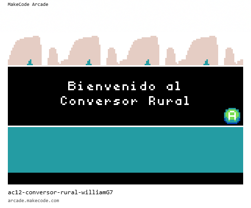

# Conversor Rural - micro:bit

Proyecto de conversión rural desarrollado con MakeCode Arcade para micro:bit.

## Descripción

Este proyecto es parte de la actividad AC12 del curso DAM2 (Desarrollo de Aplicaciones Multiplataforma) de ITEC-BCN. Se trata de un conversor rural implementado para dispositivos micro:bit utilizando TypeScript y Python.

## Características

- Implementación en TypeScript y Python
- Compatible con micro:bit
- Interfaz visual con bloques de MakeCode
- Sprites e imágenes personalizadas
- Tilemaps integrados

## Tecnologías

- **Lenguaje principal**: TypeScript
- **Lenguaje alternativo**: Python
- **Plataforma**: MakeCode Arcade
- **Hardware**: micro:bit

## Cómo usar

### Opción 1: Editar en MakeCode

1. Abre [https://arcade.makecode.com/](https://arcade.makecode.com/)
2. Haz clic en **Import** y luego en **Import URL**
3. Pega la URL: `https://github.com/ITEC-BCN/ac12-conversor-rural-williamG7`
4. Haz clic en **Import**

### Opción 2: Usar como Extensión

1. Abre [https://arcade.makecode.com/](https://arcade.makecode.com/)
2. Crea un **New Project**
3. Haz clic en **Extensions** en el menú de configuración
4. Busca: `https://github.com/ITEC-BCN/ac12-conversor-rural-williamG7`
5. Importa la extensión

## 📸 Vista Previa del Prorgama

La siguiente imagen muestra la pantalla de inicio del programa:

## Autor

- **williamG7** - [GitHub Profile](https://github.com/williamG7)

## Licencia

Este proyecto es parte de un ejercicio académico de ITEC-BCN.
